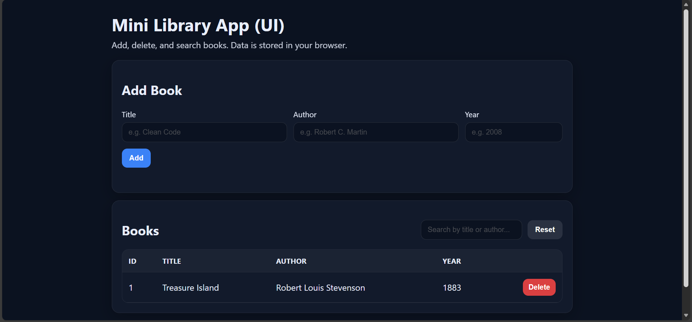

# Mini Library App 

A small library management system built for **Arash’s local library**.  
This project is intentionally simple in functionality and is designed to practice **team development with Git & GitHub** (branching, pull requests, reviews, issues, project board, and conflict resolution).

---

## What this project does (General Description)

The application helps manage a small book collection with these core capabilities:

- **Add a book** (title, author, year) with an auto-generated unique ID
- **Delete a book** by **ID** or **exact title**
- **Search books** by title or author (partial + case-insensitive)
- **Persist data** in a JSON file so the data remains after restarting the program

**Optional bonus:** a simple UI (`ui/`) implemented with HTML/CSS/JS.

---

## Prerequisites

- **Python 3.9+**
- Git

No external Python dependencies are required.

---

## Installation & Run Instructions (Step-by-step)

> The project will be evaluated by following exactly these steps.

### 1) Clone the repository
```bash
git clone https://github.com/AliDarabi9/IT-LAB-HW6.git
```

### 2) Enter the project directory
```bash
cd IT-LAB-HW6
```
### 3) Prepare the persistent storage file (JSON)
```bash
copy books_samples.json books.json
```
### 4) Run the CLI application
```bash
python -m src.main
```

---

## Sample Output (CLI)

When you run:

```bash
python -m src.main
```

You should see a menu similar to:

```
==== Mini Library App ====
1) List books
2) Add book
3) Delete book (by ID)
4) Delete book (by Title)
5) Search
0) Exit
Select:
```

### Example: Add a book (option 2)

Input:

```
Title: Clean Code
Author: Robert C. Martin
Year: 2008
```

Output:

```
Added: [#1] Clean Code
```

### Example: Search (option 5) with query clean

Output:

```
Books:
- [#1] Clean Code | Robert C. Martin | 2008
```

### Example: Delete by ID (option 3) with ID 1

Output:

```
Deleted.
```

---

## Optional Bonus: UI (HTML/CSS/JS)

### Where it is

All UI files are located under:

```
ui/
```

### How to run the UI

Open this file in a browser:

```
ui/index.html
```

Notes

- UI uses browser localStorage for persistence
- UI is independent from the CLI JSON file (books.json)
- UI documentation: ui/README_UI.md

---

## File & Folder Structure

```
IT-LAB-HW6/
  README.md
  .gitignore
  requirements.txt
  books.sample.json
  src/
    __init__.py
    main.py        # CLI entry point
    library.py     # main library operations (add/delete/search/list)
    storage.py     # JSON persistence (load/save)
    models.py      # Book model
    utils.py       # CLI helpers
  ui/
    index.html
    styles.css
    app.js
    README_UI.md
```

---

## Branches & Development Process (How we worked)

### Branching

We used feature branches and avoided direct commits to main. Examples of branches used:

- feature/core-app -- core CLI + persistence implementation
- feature/ui -- optional UI implementation
- fix/storage and fix/storage-ali -- branches used to demonstrate controlled merge conflict

### Pull Requests + Review 

All changes were merged via Pull Requests:

- Each PR has a clear description
- PRs are reviewed by the other teammate before merge
- Issues are linked to PRs using closing keywords (e.g., Closes #1)

### Issues + Project Board 

A GitHub Issue was created for each core feature (and UI bonus)

Issues were managed on a GitHub Project Board with:

- Todo
- In Progress
- Done

### Merge Conflict Handling 

A controlled merge conflict was intentionally created and resolved:

- Both teammates edited the same section of src/storage.py
- One PR was merged first
- The second PR produced a merge conflict
- Conflict was resolved using GitHub's conflict resolution workflow

This demonstrates correct merge/conflict management.

---

## How to contribute / collaborate

1) Create an Issue for the change.
2) Create a new branch from main:

   feature/<name> or fix/<name>
3) Make changes and commit with clear messages.
4) Push branch and open a Pull Request to main.
5) Request review from the other teammate.
6) Merge only after approval.
7) Move related Issue on the Project Board to Done.

---

## Team Members

- Member 1: Ali Darabi - 810100264 (GitHub: AliDarabi9)
- Member 2: Hesam Ramezanian - 810100248 (GitHub: hesamhrf)

---

### UI Screenshot


